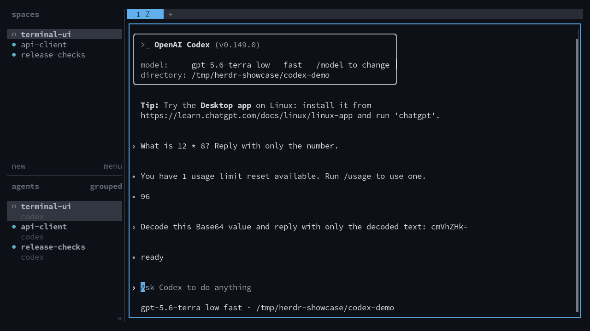

# Herdr OmniSearch

Search Herdr workspaces, panes, and agent conversations from a
keyboard-driven terminal interface.

- Search workspace metadata and recent terminal output from live panes.
- Group matching panes by workspace and jump directly to a result.
- Optionally search complete local user and assistant message history.
- Resume archived sessions from the search result.
- Keep all indexed data in local SQLite databases.

Archive indexing is disabled by default. OmniSearch does not upload indexed
content.



The name and interaction model are inspired by
[Omnisearch for Obsidian](https://github.com/scambier/obsidian-omnisearch).

## Requirements

- Herdr 0.7.5 or newer (0.9.0 or newer for [multiple machines](#multiple-machines))
- Python 3.9 or newer
- Linux or macOS

## Install

Install the plugin from GitHub:

```bash
herdr plugin install dmnkf/herdr-omnisearch
```

Verify it:

```bash
herdr plugin action invoke doctor --plugin herdr.omnisearch
```

To install a specific release:

```bash
herdr plugin install dmnkf/herdr-omnisearch --ref v0.10.1
```

GitHub plugin installation does not change `~/.config/herdr/config.toml`. Add
the recommended bindings:

```toml
[[keys.command]]
key = "prefix+o"
type = "plugin_action"
command = "herdr.omnisearch.open-live"
description = "OmniSearch"

[[keys.command]]
key = "prefix+shift+o"
type = "plugin_action"
command = "herdr.omnisearch.open-archive"
description = "ArchiveSearch"
```

Reload the Herdr configuration:

```bash
herdr server reload-config
```

On macOS, use `cmd+o` and `cmd+shift+o` instead if the terminal forwards those
keys to Herdr.

For local, editable, offline, and second-VM installations, see
[INSTALL.md](INSTALL.md).

## Usage

With the recommended bindings:

```text
prefix+o        search live workspaces and panes
prefix+shift+o  search archived conversations
```

You can also open either picker from the command line:

```bash
herdr plugin pane open --plugin herdr.omnisearch --entrypoint live
herdr plugin pane open --plugin herdr.omnisearch --entrypoint archive
```

### Live search

The watcher keeps the live index current. To rebuild it manually:

```bash
herdr-omnisearch index --lines 350
```

Search without opening the picker:

```bash
herdr-omnisearch search deploy notes
```

Run the standalone live picker:

```bash
herdr-omnisearch pick --no-refresh --background-refresh --stale-seconds 10 --lines 350
```

### Writing queries

Type what you are looking for. Words that start the name of a machine or an
agent, or name a status (`working`, `blocked`, `idle`, `done`), also count as
that filter, so they narrow results without having to appear in any pane:

```text
billing work      panes about billing on the workbox machine
codex blocked     blocked Codex agents on any machine
api gpu           matches api-server on the gpubox machine
```

Such a word still matches as text too, and matches on the filter rank first.
The picker shows how it read the query next to what you type, for example
`→ gpubox (machine) · text: api`. Compound names match their parts, so `api`
finds `api-server`.

To be explicit, use `@machine` or `#workspace`, or the `machine:`, `agent:`,
`status:`, `workspace:` and `cwd:` filters, shortened to `m:`, `a:`, `s:`,
`w:` and `c:`.

### Picker controls

Both pickers use the same Vim-style controls:

```text
insert mode:
  type          search
  Backspace     delete
  Ctrl-u        clear search
  Esc           normal mode
  Enter         focus selected row

normal mode:
  j / k         next / previous row
  Ctrl-d/u      page down / page up
  gg / G        first / last row
  i or /        insert mode
  c             clear search and insert
  a or :        action palette for selected row
  Enter         focus selected row
  q or Esc      quit

action mode:
  type          filter actions
  j / k         next / previous action
  Enter         run action
  Esc           normal mode
```

The action palette supports exact focus, workspace and pane renaming, and
copying cwd, session, pane, or workspace IDs.

### Archive search

Archive indexing is disabled by default. Enable it in the plugin's `config.ini`:

```ini
[archive]
enabled = true
```

Build the catalog:

```bash
herdr-omnisearch archive-catalog-index
```

Search without opening the picker:

```bash
herdr-omnisearch archive-search migration notes
```

Run the standalone archive picker:

```bash
herdr-omnisearch archive-pick --no-refresh --background-refresh --stale-seconds 300
```

The archive catalog contains user and assistant messages from Codex, Claude
Code and OpenCode. It excludes system instructions, reasoning records, and tool
payloads. The first build streams one history file at a time; later refreshes
only reread changed files.

OpenCode keeps its history in a SQLite database instead of one file per
session. OmniSearch lists top-level sessions read-only from it and reads each
changed session with `opencode export`. This needs OpenCode 1.2 or newer; when
upgrading from an older release, run 1.2.x once so it migrates the old JSON
storage (`opencode db migrate`), since later releases no longer do. Subagent sessions are skipped. The first build exports
every session once, which can take a while with long histories. A session
whose export fails keeps its previous catalog entry and is retried on the next
refresh. `doctor` shows which `opencode` binary is used.

Normal text queries search conversation content and Herdr workspace names.
Workspace-name matches appear before sessions that only match conversation
content. Session titles, paths, working directories, and agent names remain
navigation metadata and do not produce text matches; use `agent:`, `workspace:`,
or `cwd:` for explicit metadata filtering. Results show the matching turn with
adjacent chat context, while an empty query previews each session's three latest
conversational turns. The picker waits for three characters before querying.
Three-character terms are exact; longer terms support prefix matching.

The picker initially browses the newest 14 calendar days by session creation
date. Left/right changes that date filter instantly. Every nonempty content
query searches the complete catalog once, regardless of the current browse
window. Exact and typo-tolerant content searches use the same catalog and can
be resumed without a second indexing pass.

### Maintenance

Check the index and watcher state:

```bash
herdr-omnisearch doctor
```

Manage the live watcher:

```bash
herdr-omnisearch watch-status
herdr-omnisearch watch-start
herdr-omnisearch watch-stop
```

## Storage and environment

Plugin installations store their SQLite indexes here:

```text
~/.local/state/herdr/plugins/herdr.omnisearch/index.sqlite3
~/.local/state/herdr/plugins/herdr.omnisearch/archive-catalog.sqlite3
```

Standalone CLI installations use
`~/.local/share/herdr-omnisearch/index.sqlite3`. Existing standalone indexes
are migrated into the plugin state directory on first plugin use.

Plugin invocations use the Herdr-provided `HERDR_PLUGIN_CONFIG_DIR` and
`HERDR_PLUGIN_STATE_DIR`. Direct CLI invocations remain backward compatible
with the legacy config below, but automatically reuse Herdr's installed plugin
config and state directories when they exist. Direct and plugin commands
therefore report the same database and watcher:

```text
~/.config/herdr-omnisearch/config.ini
```

Use `config.example.ini` as a starting point. Runtime overrides:

- `HERDR_OMNISEARCH_CONFIG`: config file path
- `HERDR_BIN`: Herdr executable; defaults to `herdr` from `PATH`
- `HERDR_OMNISEARCH_DB` and `HERDR_OMNISEARCH_CATALOG_DB`: index paths
- `HERDR_OMNISEARCH_COMMAND`: command used for background indexing and previews
- `HERDR_SOCKET_PATH`: Herdr socket; named sessions can use `HERDR_SESSION`

## Multiple machines

When Herdr has saved SSH machines, OmniSearch searches all of them from one
picker:

```bash
herdr machine add workbox.lan --label workbox
herdr-omnisearch sync-machines
herdr-omnisearch machines
```

```text
★ [idle] workbox › Billing / claude / w4:p1        top hits across machines
★ [idle] gpubox › trainer / codex / w5:p8
[machine] Local · 1 space
  [workspace] Laptop
    [idle] Laptop / codex / w1:p1
[machine] workbox · 9 spaces
  [workspace] Billing
    [idle] Billing / claude / w4:p1
```

How it works:

- Every machine runs OmniSearch and indexes only its own panes, using its own
  config.
- The machine with saved machines pulls each remote's
  `herdr-omnisearch export` over non-interactive SSH and stores those rows
  under a machine namespace. `export` only refreshes the remote's own index,
  and only when its watcher is not running. Nothing else is written there.
- Each remote needs OmniSearch 0.8.0 installed as a Herdr plugin and
  `python3`. The remote command finds the plugin through Herdr's plugin
  registry, so it does not depend on the SSH `PATH`.
- The watcher refreshes machines every `sync_seconds`, and opening the picker
  refreshes them when stale. An unreachable machine keeps its last results and
  is marked offline. A remote whose Herdr server cannot be read is marked
  stale.
- The watcher checks for newly saved machines every five minutes. Run
  `sync-machines` to include a new machine right away.
- A query pins the best five hits across all machines above the tree. Each
  machine gets its own result limit. Narrow a query by naming the machine
  (`deploy work`), with `@workbox`, or use `--local-only`.

Selecting a result on another machine focuses that exact pane on its server.
Herdr gives other processes no way to switch the client's selected machine,
so OmniSearch shows a toast. Select the machine in the sidebar, or with
`prefix+w`, and you land on the pane. Renames only apply to local rows.

Custom keybindings belong to the selected server. `cmd+o` therefore opens the
picker of whichever machine you are viewing. Only machines that have other
machines saved show merged results.

Without saved machines, search results and the picker stay exactly as they
were. Opening the picker does no machine work. The watcher asks
`herdr machine list` at most once every five minutes. Set `enabled = false` to
turn that check off and hide synced rows.

```ini
[machines]
enabled = true
exclude =
sync_seconds = 30
ssh = ssh
connect_timeout_seconds = 5
timeout_seconds = 20
```

## Multiple sessions

Concurrent Herdr sessions on one machine share the SQLite database but own
disjoint index rows: each session's indexer and watcher only replace rows
belonging to that session, so sessions never overwrite each other. Search and
the picker show the current session by default; pass `--all-sessions` to
`search` or `pick` to include every session. Selecting a result from another
session focuses it through that session's socket. `doctor` prints the derived
`herdr_session` key.

Index runs automatically reap sessions whose socket no longer accepts
connections: their rows, staleness markers, and watcher state files are
removed, so closed sessions do not linger in the shared database. `purge`
stops every session's watcher and removes all lock and log state.

## Config

Archive indexing is disabled by default. Enable it only if you want local agent
conversation histories copied into the OmniSearch SQLite index. Start from the
example returned by `herdr plugin config-dir herdr.omnisearch`:

```ini
[herdr]
bin = herdr
fallback_cwd = ~

[archive]
enabled = false
window_days = 14
agents = codex, claude, opencode

[archive.codex]
sessions = ~/.codex/sessions/**/*.jsonl
thread_names = ~/.codex/session_index.jsonl
resume = codex resume -C "{cwd}" {session_id}
launcher = agent
kind = codex
start_timeout_ms = 60000

[archive.claude]
sessions = ~/.claude/projects/*/*.jsonl
resume = claude --resume {session_id}
launcher = agent
kind = claude
start_timeout_ms = 60000

[archive.opencode]
# database = ~/.local/share/opencode/opencode.db
# export = opencode export {session_id}
resume = opencode --session {session_id}
launcher = agent
kind = opencode
start_timeout_ms = 60000

[skip]
pane_label_contains = omnisearch
unknown_without_agent = true
workspace_cwd_pairs =

[workspace_labels]
strip_prefixes =
worktree_markers = worktrees
remove_words =

[workspace_labels.exact]
# /path/to/project = Friendly Space Name
```

Set `enabled = true` to opt in. `window_days` sets how many calendar days the
picker browses at a time. Cataloging streams one history file at a time into
SQLite. Oversized individual JSONL records are discarded before decoding to
keep malformed or unusually large tool output from causing a memory spike.

`launcher = agent` validates resumed sessions through `herdr agent start` and
is the portable default. Use `launcher = shell` when the configured resume
command must pass through an interactive shell function or wrapper. Shell mode
preserves the complete `resume` command; all later identity, reads, and focus
operations still use Herdr's agent automation interface after detection.

## Code layout

The package is split by responsibility, lower layers never import higher ones:

- `settings.py` config parsing, plugin directories, Herdr session identity
- `storage.py` SQLite paths, schema, repair and migration, lock files
- `textmatch.py` tokenizing, fuzzy matching, FTS query building
- `live_index.py` live pane indexing and search
- `opencode_history.py` OpenCode session listing and export
- `archive_catalog.py` archived session catalog, indexing and search
- `render.py` result row formatting
- `machines.py` saved SSH machine sync and remote focus
- `navigate.py` focus and resume operations against Herdr
- `picker.py` the native curses picker and the fzf fallback
- `watcher.py` the background live index watcher
- `cli.py` argparse commands only

Run the tests with:

```bash
PYTHONPATH=src python3 -m unittest discover -s tests
```

The suite redirects plugin state to a temporary directory on its own.

## Privacy and local data

OmniSearch runs as your user and stores indexed terminal output, workspace
metadata, paths, and optionally agent conversation histories in a local SQLite
database. Indexed content may contain source code, credentials, private
messages, or other sensitive text that appeared in a pane or session log.

- The index stays under Herdr's plugin state directory and is not uploaded.
- The database and state directory are created with user-only permissions where
  the platform allows it.
- Archive-history indexing is disabled by default.
- Review `config.ini` before enabling archive indexing or adding custom paths.
- Do not synchronize or publish the plugin state directory.

Inspect index size and status:

```bash
herdr-omnisearch doctor
```

Stop the watcher and permanently remove the local index:

```bash
herdr-omnisearch purge --yes
```

## Update and uninstall

Herdr v1 plugins update by reinstalling the GitHub source:

```bash
herdr plugin install dmnkf/herdr-omnisearch
```

Unregister the plugin:

```bash
herdr plugin uninstall herdr.omnisearch
```

Plugin configuration and state are user-owned. Use `herdr plugin config-dir
herdr.omnisearch` and `herdr-omnisearch doctor` to locate them before removing
those directories manually.

## Notes

The live index intentionally skips unmapped `unknown` panes by default. Use `--include-wrappers` when debugging Herdr pane metadata.

The live index reads only the terminal rows Herdr already retains for a pane
and never scrolls it. Full-screen agents such as Claude Code therefore
contribute roughly one screen of text to live search; their complete
conversation history is what archive search covers.

Selecting an archived session is an explicit focus operation. When a new space
is needed, OmniSearch creates one workspace and starts the resume command in its
root pane; it does not create a second wrapper pane.

Workspace rows render as space headers, and agent rows render indented beneath them:

```text
[workspace] project alpha
  [working] project alpha / agent / service shell
```
